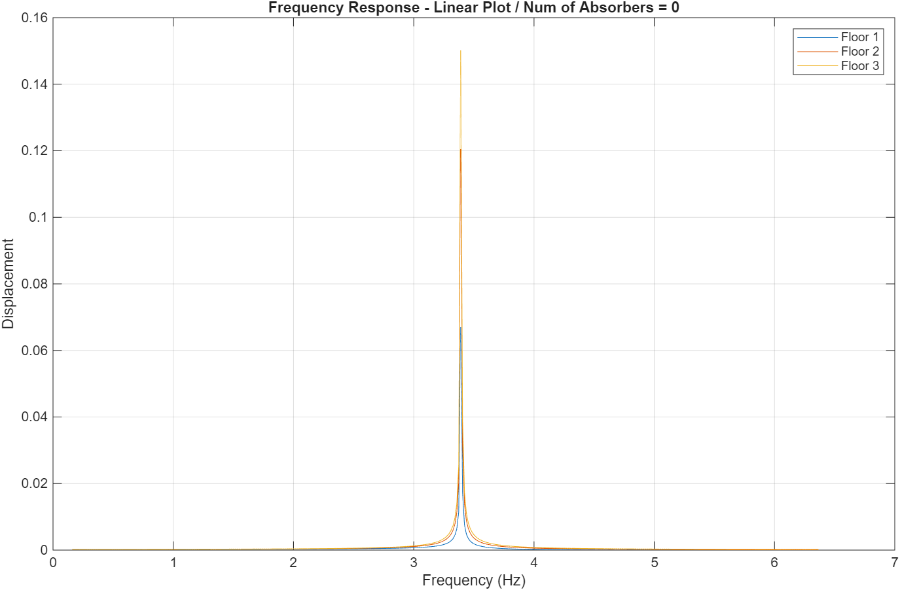
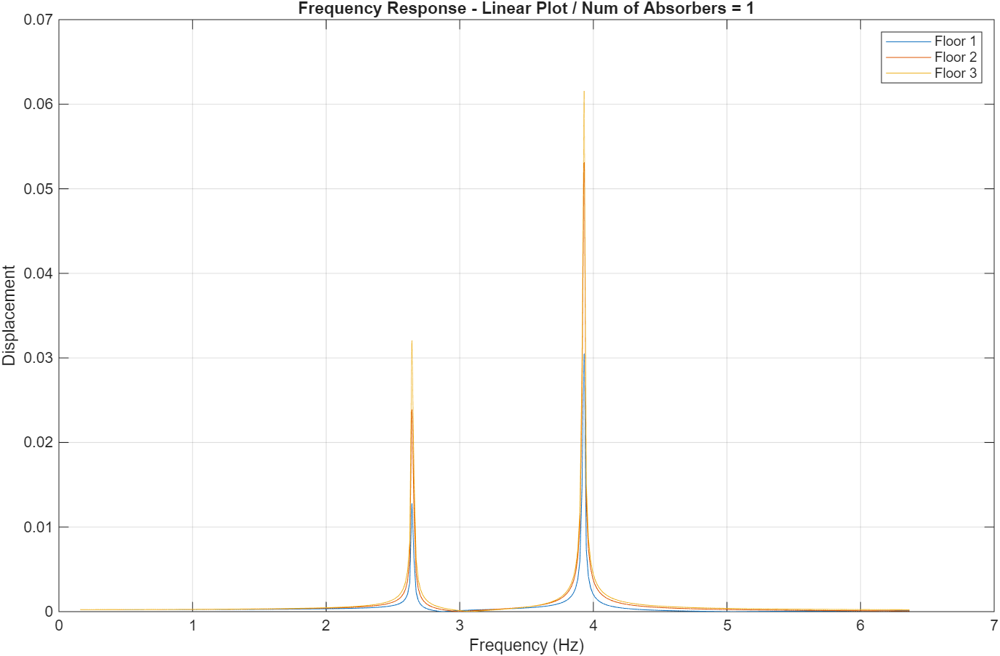
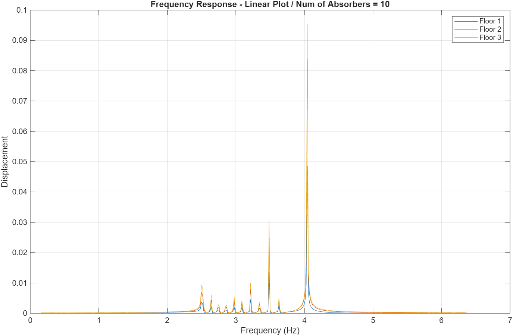
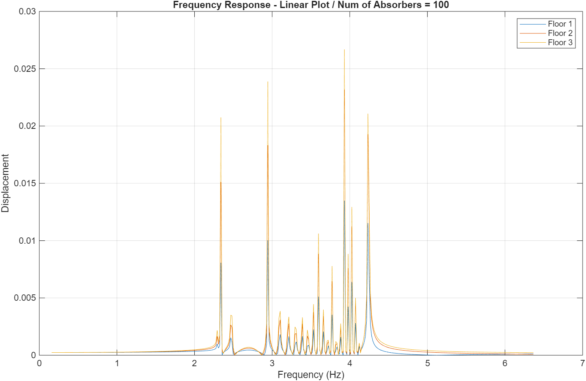
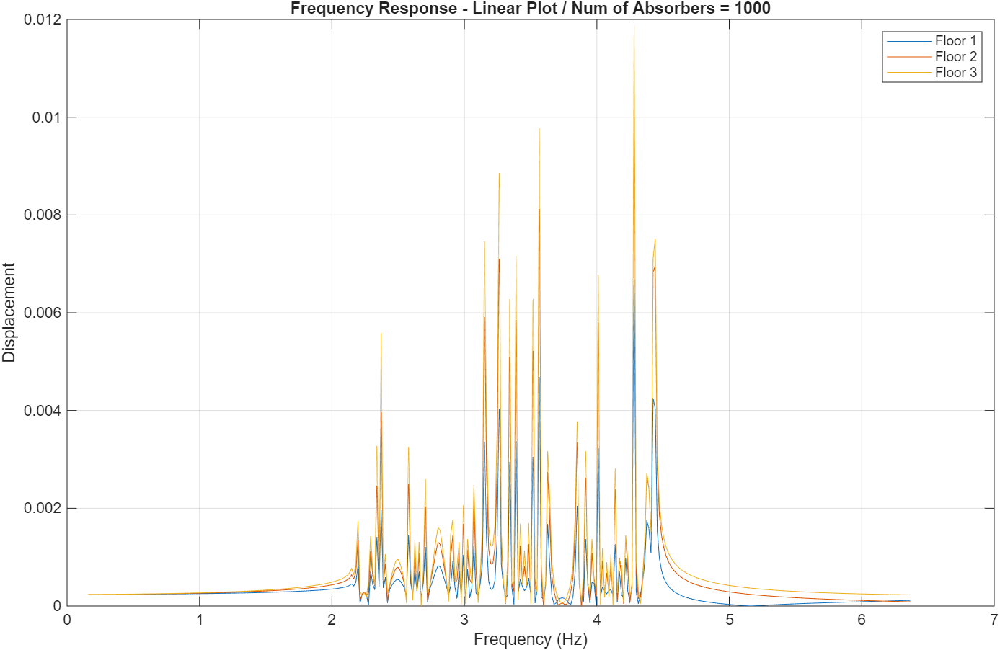

# Broadband Vibration Control with Multiple Tuned Mass Dampers

A MATLAB numerical investigation into the effectiveness of using multiple, distributed tuned mass dampers (MTMDs) for suppressing structural vibrations over a wide frequency range, as opposed to a single, traditional TMD.

## 🧐 Overview

The **Tuned Mass Damper (TMD)** is a well-established device for mitigating resonant vibrations in structures. However, a single TMD has a critical drawback: while it suppresses vibration at one target frequency, it introduces **two new resonant peaks** on either side of it. This is problematic for loads like **earthquakes** or **wind turbulence**, which contain energy over a broad frequency spectrum.

This project explores the solution of using **Multiple Tuned Mass Dampers (MTMDs)**. By distributing a fixed total mass across many small absorbers, each tuned to a slightly different frequency, we can "smear" the two new peaks into a single, wide band of effective vibration suppression.

**Key Question:** For a fixed total absorber mass, how does the number of TMDs (1, 10, 100, 1000) affect the bandwidth and effectiveness of vibration reduction?

## 🎯 Theoretical Background

- The system is a 3-story building modelled as a lumped-mass structure.
- TMDs are added as secondary spring-mass systems to the top floor (where displacement is greatest). 
- The total mass of all TMDs is constrained to be 10% of the total building mass.

The core of the analysis involves distributing the natural frequencies of the `N` TMDs around the first natural frequency of the building. This project investigates several distribution strategies:
- **Linear Spacing**
- **Logarithmic Spacing**
- **Adaptive Bandwidth**

Performance is evaluated by computing and comparing the **Frequency Response Function (FRF)** of the top floor for each configuration.

## 📊 Key Findings
The simulation results clearly demonstrate the trade-off between the number of TMDs and the performance bandwidth:

- Single TMD (N=1): Effective at the target frequency but introduces two distinct, new resonant peaks.

- 10 TMDs: Begins to merge the two peaks, creating a wider but uneven "valley" of suppression.

- 100 TMDs: Creates a smooth, wide, and flat region of attenuation. The resonant peaks are effectively smeared.

- 1000 TMDs: Provides the widest spread. The adaptive bandwidth strategy results in the broadest and most uniform "vibration absorption valley," ideal for broadband excitation.

## 📈 Results

  
  
  *Frequency Response with no absorbers for sinusoid input.*

  
  
  *Frequency Response with 1 absorber for sinusoid input.*

  
  
  *Frequency Response with 10 absorbers for sinusoid input.*

  
  
  *Frequency Response with 100 absorbers for sinusoid input.*

  
  
  *Frequency Response with 1000 absorbers for sinusoid input.*

